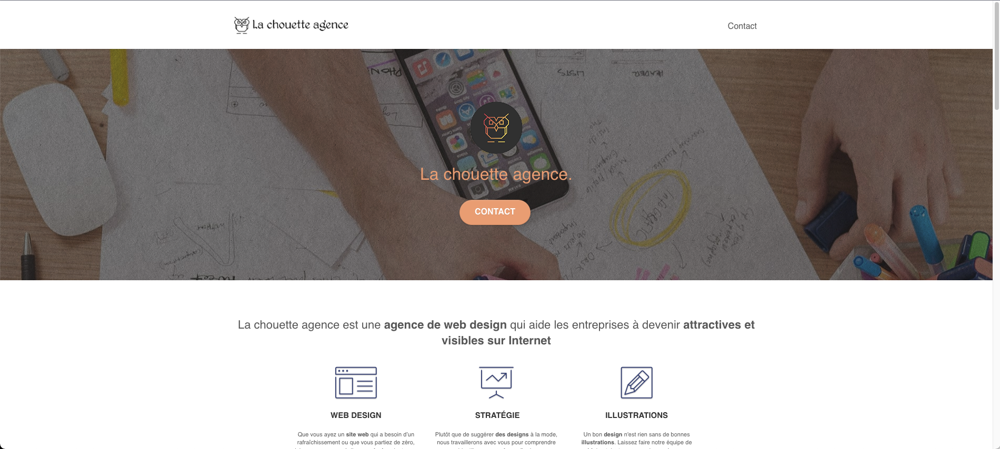

# La chouette agence

Fourth project of the web developer course at Openclassrooms. The objective is to improve the performance, accessibility and SEO of a site of a web agency called "La chouette agence".

## Elements corrected for this project:

- The basic tags for SEO.
- The removal of dangerous practices for SEO.
- Optimization and matching of site images.
- Optimization of website accessibility.
- Reduced file and framework sizes.

## Used tools

- The [Google search console.](https://search.google.com/)
- [Google analytics](https://analytics.google.com/)
- Chrome DevTools

## Notes on the realization of the project

- The integration is done on the Visual Studio Code editor with the [Live server](https://marketplace.visualstudio.com/items?itemName=ritwickdey.LiveServer) & [Github copilot](https://copilot.github.com/) plugins. The theme, UI and keyboard shortcuts are customized.
- [Bootstrap](https://getbootstrap.com/) is used to organize the css.

## Contact

You can contact me by email : jeremy.lorette@outlook.com
